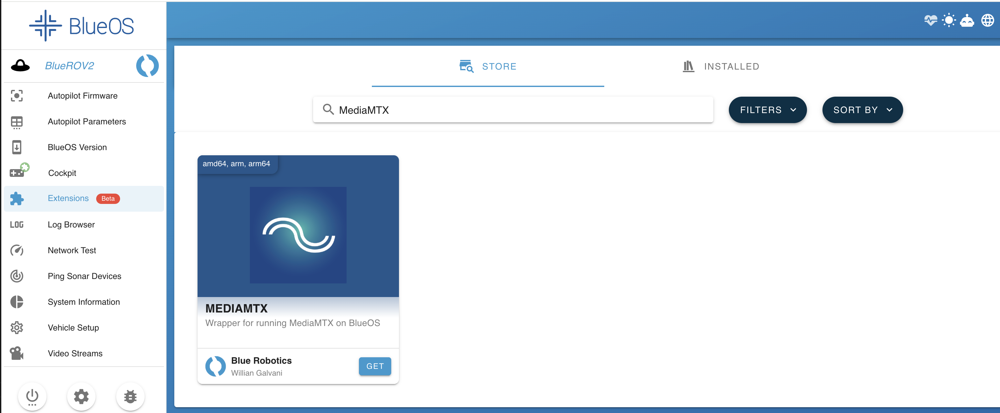
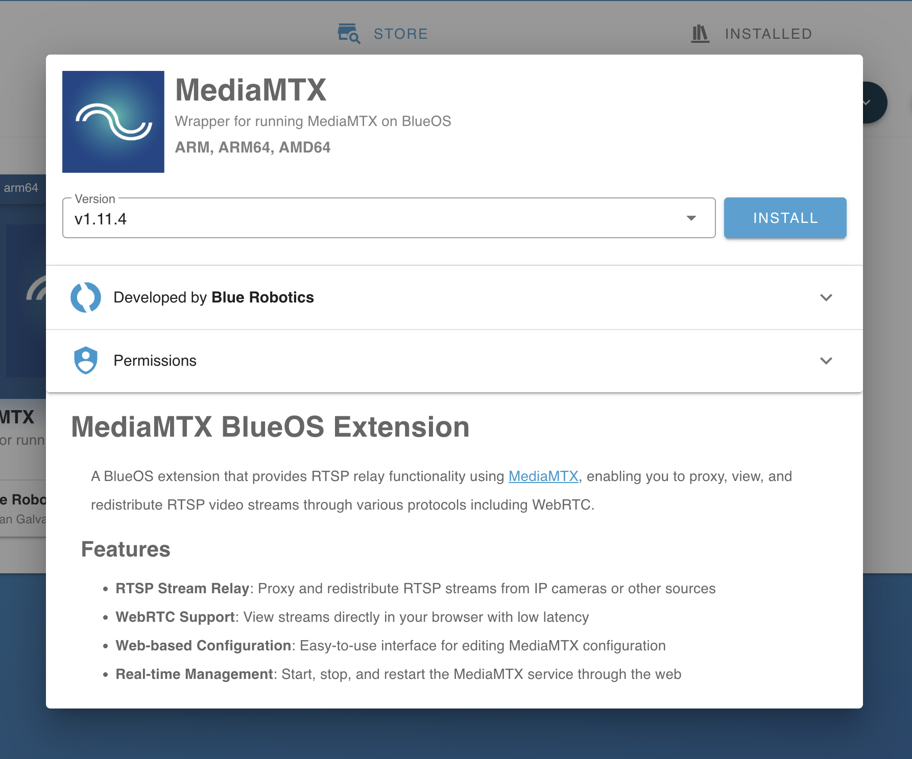
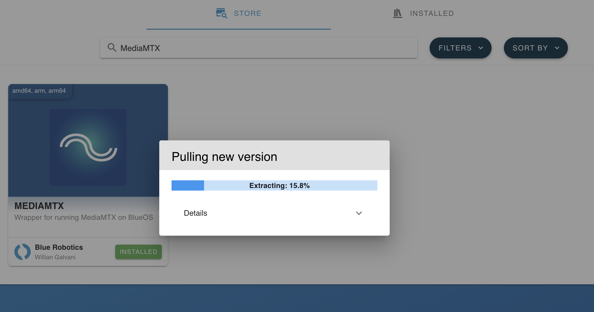

# fix camera issue

my laptop is is 192.168.254.242

## MediaMTX

### install





### review docker

```sh
docker ps -a

CONTAINER ID   IMAGE                                              COMMAND                  CREATED             STATUS             PORTS                     NAMES
9c753e3fd260   williangalvani/blueos-extension-mediamtx:v1.11.4   "/app/start.sh"          48 seconds ago      Up 46 seconds                                extension-williangalvaniblueosextensionmediamtxv1114
9e7487be9761   public.ecr.aws/blueos/bcloud-agent:2025-04-10      "./run.sh"               13 minutes ago      Up 13 minutes                                extension-publicecrawsblueosbcloudagent20250410
6d1562929f9c   bluerobotics/blueos-core:1.4.3                     "/bin/bash -i -c '/u…"   About an hour ago   Up 13 minutes                                blueos-core
13733dbf5f37   bluerobotics/cockpit:v1.16.0-beta.1                "simple-http-server …"   About an hour ago   Up About an hour   0.0.0.0:32768->8000/tcp   extension-blueroboticscockpitv1160beta1
70d595e29378   bluerobotics/blueos-bootstrap:1.4.2                "/main.py"               10 months ago       Up About an hour                             blueos-bootstrap
```

### configure with hardware encoding

```yaml
paths:
  input:
    runOnInit: ffmpeg -f v4l2 -i /dev/video0 -c:v h264_v4l2m2m -b:v 600k -f rtsp rtsp://localhost:$RTSP_PORT/$MTX_PATH
    runOnInitRestart: yes

rtspAddress: :8555
webrtcAddress: :8889
webrtcICEServers: ["stun:stun.l.google.com:19302"]
api: false
metrics: false
pprof: false
logLevel: debug
```

### software encoding

```sh
ffmpeg -f v4l2 -i /dev/video0 -c:v libx264 -pix_fmt yuv420p -preset ultrafast -b:v 600k -f rtsp rtsp://localhost:$RTSP_PORT/$MTX_PATH
```

### add to stream manager

UI has bug, so let's use API

```sh
curl -X POST http://blueos.local:6020/streams \
  -H "Content-Type: application/json" \
  -d '{
    "name": "MediaMTX RTSP",
    "source": "Redirect",
    "stream_information": {
      "endpoints": ["rtsp://localhost:8555/input"],
      "configuration": {
        "type": "redirect"
      },
      "extended_configuration": {
        "thermal": false,
        "disable_mavlink": false
      }
    }
  }'
```

if you want to delete , use this

```sh
curl -X DELETE "http://blueos.local:6020/delete_stream?name=MediaMTX%20RTSP"
```

## let's confirm on laptop

```sh
brew install ffmpeg
ffplay -fflags nobuffer rtsp://192.168.2.160:8555/input
```

## let's confirm with Cockpit

- Open Cockpit On Browser

## Conclusion

```text
Camera (/dev/video0, MJPG only)
  → MediaMTX (ffmpeg. MJPG → H264 , RTSP Port 8555)
    → BlueOS Redirect Stream (MAVLink. RTSP URL Translation)
      → Cockpit (WebRTC Playback)
```

## Appendix

### ffmpeg Options

| Option                                  | Description                                                                                                                             |
| --------------------------------------- | --------------------------------------------------------------------------------------------------------------------------------------- |
| `-f v4l2`                               | Sets the input format to Video4Linux2. The standard method for reading camera devices on Linux                                          |
| `-i /dev/video0`                        | Input source. The first camera device                                                                                                   |
| `-c:v h264_v4l2m2m`                     | Video codec. Converts to H264 using the V4L2 Memory-to-Memory hardware encoder. Uses the Raspberry Pi's GPU, resulting in low CPU usage |
| `-b:v 600k`                             | Video bitrate 600kbps. A reasonable low-bandwidth setting for 720p                                                                      |
| `-f rtsp`                               | Sets the output format to RTSP                                                                                                          |
| `rtsp://localhost:$RTSP_PORT/$MTX_PATH` | Output destination. MediaMTX automatically substitutes the environment variables -- `$RTSP_PORT` is 8555, `$MTX_PATH` is `input`        |

### Software vs Hardware Encoding Comparison

| Category                  | libx264 (SW)       | h264_v4l2m2m (HW) |
| ------------------------- | ------------------ | ----------------- |
| CPU Usage                 | High (50-90%)      | Low (5-15%)       |
| Quality (at same bitrate) | Better             | Slightly lower    |
| Latency                   | Varies with preset | Low               |
